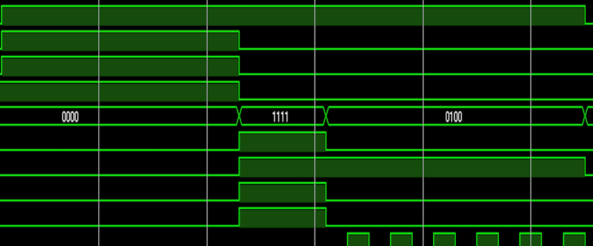
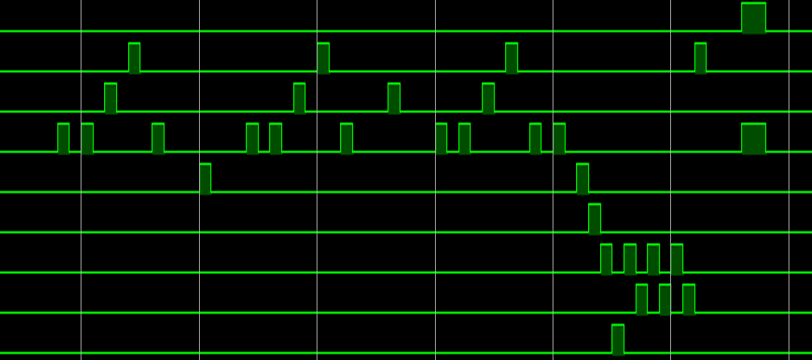
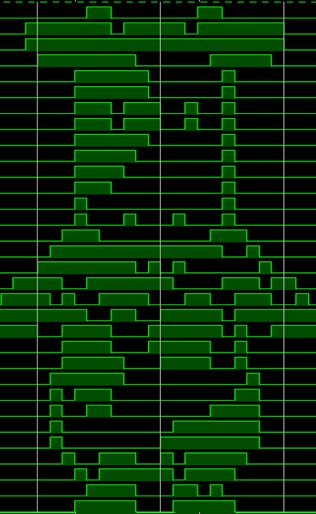
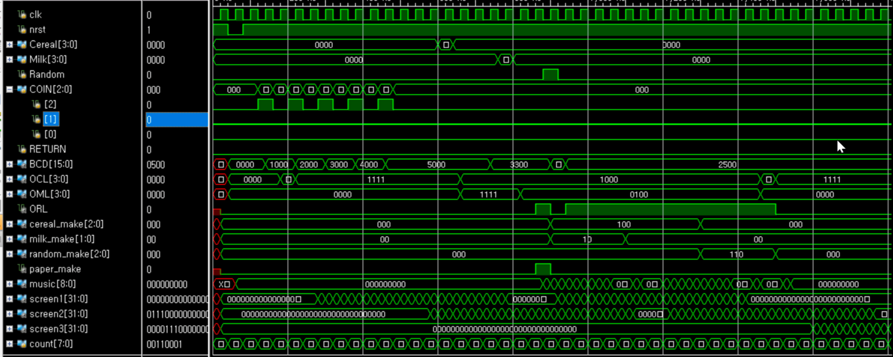

# Verilog HDL(Hardware Description Language)
   * 디지털 시스템 설계를 위한 하드웨어 기술 언어, C언어와 흡사하다.
   * HDL로 기술된 하드웨어는 병렬적이고 동시적으로 동작한다.
   * 계층적 구조를 가진다.
----
### 2인 Term Project 진행
* Title
   - 자판기에 관한 아이디어를 구상해서 Verilog로 구현하기
* Main Purpose of this Project
   - Understand Verilog hardware description language (HDL)
   - Understand how to design a finite state machine (FSM)
   - Use Vivado design suite to implement and simulate digital circuits
* Date 2019.11.14 ~ 2019.12.18
* Details - 시리얼 자판기
   - 세 종류의 시리얼 : 첵스 초코, 콘푸로스트, 그래놀라
   - 우유 : ICE/HOT, (0/50/10)% 양 조절
   - 토핑 추가 : 랜덤 기능
   - 작동 시 노래기능 / 스크린 투영 기능
* Modules
   - VendingM (Top module)
      - Control module
      - Insert_Coin module
      - Making_cereal module
      - Music module
      - Screen module
* Result Simulations
   - 동전주입부:동전주입  
   
   - 동전주입부:동전반환  
   
   - 제어모듈:주문받기  
   
   - 노래재생  
   
   - 스크린출력  
   
   - 자판기전체  
   

* 후기
   - 언어를 숙지하고 프로그램을 짜는것은 어렵지 않았으나, 모듈과 모듈사이에서 동작하는 부분들을 정의하기가 어려웠고 관리하기도 어려웠다. 팀원과 함께 프로그램을 만들다 보니 부분을 나누어서 작업을 하기 시작했으며 이를 연결하는 부분의 모듈도 시간을 잡아먹었던 것 같다. 시뮬레이션에 대한 결과를 정리해서 팀원과 공유를 했었다면 좀 더 효율적인 작업을 진행할 수 있었지 않았을 까 생각한다.
----
### XILINX 의 Vivado Design Suit를 이용한 Verilog HDL 공부입니다
* 공부에는 2014.4 버전을 이용
* 관련 페이지
    - https://www.xilinx.com

### 공부 후기
기본적인 언어에 대한 문법을 이해하는데는 C언어와 유사하여서 힘든점은 없었다.  
하지만 하드웨어적인 부분(비트 / 회로 / 비동기, 동기) 등을 다루는 부분에서는 서툰감이 없지 않았다.  
모듈과 모듈사이의 연결, 모듈의 입/출력을 많이 신경써서 하드웨어를 구성한다면 어렵지않다는 점을 느낄 수 있었다. 

----
### 공부 내용
- Top-level Module : 최상위 모듈로서 실제 하드웨어의 입출력에 연결됨.
   * Compile, Synthesis, Simulation의 시작 모듈

- Module Definition Syntax
   ```
   module 모듈이름 (입력, 출력, 단자);
      input wire [7:0] inW;
      output wire [7:0] ouW;
      input reg [7:0] inR;
      output reg [7:0] ouR;

      assing ouW = inW;
      always @(<conditions>) begin
         ouR {<= or =} inR;
      end
   endmodule
   ```
   * Direction
      - 입력 : input
      - 출력 : output
      - 입출력 : inout
         > top-module 에서만 사용한다
   * Data Type
      - wire : 물리적인 연결
      - reg : 데이터 저장 기능
   * Size
      - [i:j] / i ~ j까지의 비트
   * 모듈에서 모듈을 이용할(불러올) 수 있다  
      ``` <모듈이름> <변수명>(<입, 출력 단자>); ```

- Expression of Number   ``` <size>'<radix><value> ```
   * Size : 비트의 크기
   * Radix
      - Binary : 2진수 : b or B
      - Octal : 8진수 : o or O
      - Decimal : 10진수 : d or D
      - Hexademical : 16진수 : h or H

- Logic Value
   * 0 : Zero, Login Low, False, GND
      - 1'b0
   * 1 : One, Login, High, VCC
      - 1'b1
   * X : Unknown
      - 1'bX
   * Z : High Impedance, Unconnected, Tri-State
      - 1'bZ

- Data Type
   * Net Type : wire, 물리적인 연결을 의미한다.
   * Register Type : reg, inteager(32비트 고정), real, time, 가상의 데이터 저장 공간
   * Parameter Type : parameter <para_name> = <value>; , 상수를 나타낸다.
   * Array Type : 메모리 정의에 활용된다.
      - reg[15:0] mem[0:1023]; = 0~1023 주소공간에 16 bits 데이터 저장 변수
      - mem[15] = 16'hA; = 15번 째 주소 공간에 값을 넣음
      - out = mem[1020]; = out 변수에 1020번 째 주소 공간 값 저장

- Specify Value
   * wire : assing <wire 이름> = <연산>;
   * reg : always(클럭 신호 블럭)와 initial(시뮬레이션이 시작될 때 실행되는 블럭)안에서 만 결과 처리
      - Blocking [=](순차실행)
         ```
         A = B + C;
         E = A + B;
         E 는 반드시 (B + C + D)
         ```
      - Non Blocking [<=](동시 실행)
         ```
         A = B + C;
         E = A + B;
         E 는 (이전 A값 + D)
         ```
      - 하나의 always block에서만 reg를 지정해야 한다.
         >  두 개의 블럭에서 reg 사용 = 충돌

- Operators
   * Vector Operator : 배열과 유사
      - A[3:0] = A[3]A[2]A[1]A[0]
   * Logical Operator : 입력인자를 0 혹은 1로만 인식
      - &&, ||, !
   * Bitwise Operator : 두개의 인자 비교, 각 bit에 대해 연산을 수행한다.
      > bit수가 작은 쪽의 왼쪽에 0이 붙어 연산한다. (입력인자 bit 크기가 다르면 작은쪽이 연장)
      - &, |, ^, ~
   * Bit Reduction Operator : 하나의 vector형의 bit들 끼리 연산
      - &, ~&, |, ~|, ^, ~^
   * Relational Operator
      - ==, !=, <, >, <=, >=
   * 사칙연산과 쉬프트는 C와 유사하다.
- Special Operators
   * Concatenation Operator : 여러 인자를 합쳐서 하나의 인자로 만드는 연산자
      - {5'b10101, 2'b01, 1'b1} = 8'b10101011
   * Conditional Operator : 조건문
      - Wire Syntax  
         ``` <조건문> ? <출력문1> : <출력문2> ```
      - Reg Syntax : 반드시 always 블럭 안에서만 해야한다  
         ```
         if(<조건문>)   <출력문1>
         else if(<조건문>) <출력문2>
         else  <출력문3>
         ```
         ```
         case(<변수>)
            <값1>:  <실행문1>;
            <값2>:  <실행문2>;
            default: <실행문3>;
         endcase
         ```

* Simulation : initial 블럭은 시뮬레이션 때 호출된다.
   ``` `timescale <time_unit>(지연시간의 단위)/<time_precision>(시뮬레이션의 시간정밀도) ```
   ```
      timescale 1ns/1ps
      assign #10(delay) <wire> = <value>;
   ```

* Combinational Circuit
   - 출력값이 그 시점의 입력값에 의해서만 결정되는 논리회로
   - 저장 능력을 갖지 않는 경우
* Sequencial Circuit
   - 현재의 출력이 현재의 입력과 이전 상태에 의해 결정되는 회로
   - 회로에 메모리 기능이 추가 된 논리회로(Flip-Flop)
   - 동기 회로(Synchronous)
      - 클럭 신호에 의해 상태 변화가 발생한다.
   - 비동기 회로(Asynchronous)
      - 상태변화가 클럭 이외의 신호에 의해 발생
         > clock을 안 사용하므로 저 전력이지만 난이도가 높다

* 기억소자
   - Latch(Level-Triggered) : Clock이 1 혹은 0 일 때 동작
   - Flip-Flop(Edge-Triggered) : Clock이 0에서 1(Positive Edge), 혹은 1 에서 0(Negative Edge)으로 변할 때 동작

* Propagation Delay : 입력이 주어지고 출력이 변할 때 까지의 시간
   > Critical Path(가장 시간이 오래 걸리는 경로)에 의해 결정된다.
* Setup Time : 입력 신호가 안전하게 공급되게 먼저 입력값을 주어야 하는 시간
* HoldTime : 입력신호가 출력에 안전하게 반영되기 위해 계속 신호값을 유지하는 시간
   > 지키지 않으면 값이 바뀔 수도 있다.

회로는 항상 최대 클럭 주파수 이하에서 동작시켜야한다. (넘으면 오류 확률이 올라간다)   
최대 클럭 주파수가 낮을수록 동작속도가 느리다.